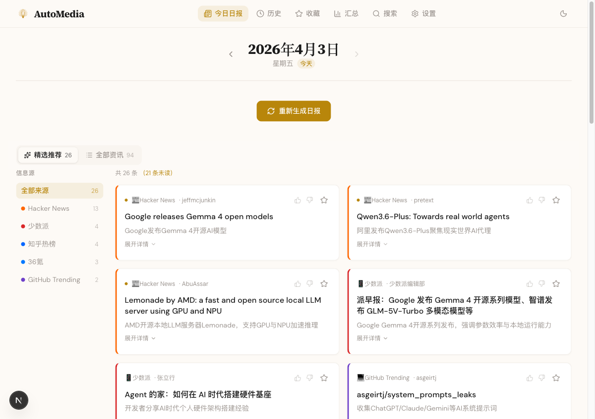
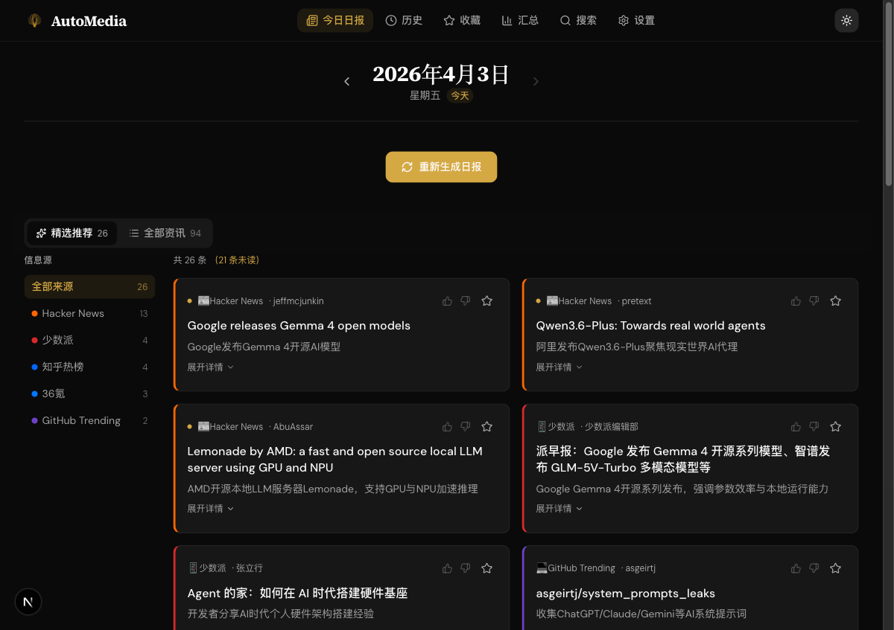

# AutoMedia

AI 驱动的每日资讯聚合工具。从多平台采集内容，经 AI 评分、去重、摘要后以日报形式展示。

## 预览



<details>
<summary>暗色模式</summary>



</details>

## 功能特性

- **多源并行采集**：GitHub Trending、知乎热榜、Hacker News、36氪、少数派
- **AI 智能处理**：三维评分（相关性/新颖性/影响力）、跨源去重、一句话概述 + 详细摘要
- **个性化训练**：👍/👎 评价 → AI 偏好画像 → 评分自动适配你的口味
- **趋势追踪**：跨天话题匹配，连续出现的话题标记 🔥 趋势标签
- **增量更新**：多次生成只处理新增内容，收藏和已读状态永不丢失
- **SSE 实时进度**：Server-Sent Events 推送进度，分阶段计时
- **全文搜索**：SQLite FTS5 全文索引
- **定时生成**：node-cron 定时任务 + Telegram 推送通知
- **周报/月报**：AI 生成趋势分析 + 要闻汇总

## 技术栈

| 层 | 技术 |
|---|---|
| 框架 | Next.js 16 (App Router) + React 19 + TypeScript |
| 样式 | Tailwind CSS 4 + shadcn/ui |
| 数据库 | SQLite (better-sqlite3) + Drizzle ORM |
| AI | Vercel AI SDK (`ai` + `@ai-sdk/anthropic` + `@ai-sdk/openai`) |
| RSS | RSSHub 公共实例 + rss-parser |
| 实时 | Server-Sent Events (EventEmitter + ReadableStream) |

## 快速开始

### 前置要求

- Node.js 20+
- pnpm

### 安装

```bash
git clone https://github.com/xykjlcx/AutoMedia.git
cd AutoMedia
pnpm install
```

### 配置

```bash
cp .env.example .env.local
# 编辑 .env.local 填入你的配置
```

### 运行

```bash
pnpm db:generate   # 生成数据库迁移
pnpm db:migrate    # 执行迁移
pnpm dev           # 启动开发服务器
```

打开 http://localhost:3000，点击"生成今日日报"即可。

### AI 模型配置

在设置页面（/settings）配置 AI 模型：

- 支持 Anthropic 和 OpenAI 兼容协议
- 填入请求地址、API Key、模型名称
- 快速模型用于评分/去重，质量模型用于摘要生成

## 项目结构

```
src/
├── app/                    # Next.js App Router
│   ├── api/
│   │   ├── digest/         # 日报（触发/SSE流/数据）
│   │   ├── ratings/        # 用户评价
│   │   ├── favorites/      # 收藏
│   │   ├── search/         # 全文搜索
│   │   ├── settings/       # 设置（模型/定时/通知）
│   │   └── sources/        # 信息源管理
│   └── (pages)
├── components/
│   └── digest/             # 日报组件
├── lib/
│   ├── ai/                 # AI 处理模块
│   ├── collectors/         # 数据采集器
│   ├── db/                 # 数据库
│   ├── pipeline.ts         # 核心 pipeline
│   ├── pipeline-events.ts  # SSE 事件总线
│   ├── scheduler.ts        # 定时任务
│   └── notify.ts           # Telegram 通知
```

## Pipeline 数据流

```
触发生成 → 并行采集（5源同时）
              ↓ URL 去重写入 raw_items
         增量过滤（跳过已有 URL）
              ↓
         AI 评分（2路并发，每批20条）
              ↓
         跨源去重（AI 语义判断）
              ↓
         AI 摘要（2路并发，每批5条）
              ↓
         趋势分析（对比过去7天）
              ↓
         增量写入 digest_items
              ↓
         完成 → Telegram 通知
```

## 开发命令

```bash
pnpm dev           # 开发服务器
pnpm build         # 生产构建
pnpm db:generate   # 生成迁移
pnpm db:migrate    # 执行迁移
```

## License

MIT
